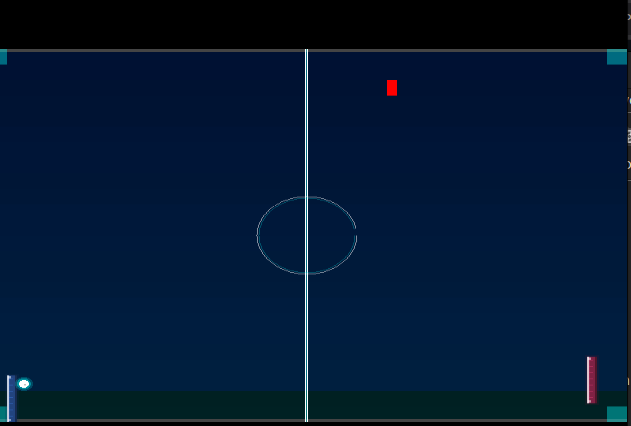

# WiingPong 🎮

[](https://github.com/cristianino/WiingPong/actions/workflows/build-and-release.yml)
[](https://opensource.org/licenses/MIT)
[](https://en.wikipedia.org/wiki/Wii)

**WiingPong** es un juego clásico de Pong desarrollado como homebrew para Nintendo Wii. Construido desde cero usando C++, GRRLIB y devkitPro, ofrece una experiencia nostálgica con los controles únicos del Wiimote y funcionalidades avanzadas de debug.

 <!-- Añade una captura cuando tengas -->

## ✨ Características

- 🎯 **Control intuitivo** con Wiimote (botones A y B)
- 🎮 **Gameplay clásico** de Pong con IA
- 🔊 **Audio dual**: Sonidos en TV y Wiimote speaker
- 🏆 **Sistema de puntuación** visual
- �️ **Debug visual opcional** para troubleshooting
- ⚙️ **Sistema de configuración** en tiempo de compilación
- 📱 **Interfaz limpia** con feedback visual
- 🔧 **Código abierto** y altamente modificable

## 🎮 Controles

### Controles Principales
- **Botón A**: Mover barra hacia arriba
- **Botón B**: Mover barra hacia abajo  
- **HOME**: Salir del juego

### Controles de Debug
- **PLUS + MINUS (mantener 4 segundos)**: Activar/desactivar ventana de debug
  - Aparece barra de progreso visual
  - Indicadores laterales A (verde) y B (azul)  
  - Se completa en amarillo al 80%
  - ⚠️ **Nota**: Cambiado de A+B para no interferir con el gameplay

### Ventana de Debug
Cuando está activada, muestra:
- ✅ Estado de inicialización WPAD (verde/rojo)
- 🎯 Indicadores individuales de **TODOS** los botones con colores:
  - A (azul), B (rojo), HOME (gris)
  - PLUS/MINUS (blanco)
  - **Cruz direccional completa** (UP/DOWN/LEFT/RIGHT en dorado)
  - **Botones numéricos 1 y 2** (verde/rojo claro)
- 📊 Representación hexadecimal bit a bit
- 🔍 Estado en tiempo real de todos los controles

## 🚀 Instalación Rápida

### Para Usuarios (Wii)

1. **Descarga** la última release desde [Releases](https://github.com/cristianino/WiingPong/releases)
2. **Extrae** el archivo `.zip` o `.tar.gz`
3. **Copia** la carpeta `apps` a la raíz de tu SD
4. **Inserta** la SD en tu Wii
5. **Ejecuta** desde Homebrew Channel

### Para Desarrolladores

```bash
# Clonar el repositorio
git clone https://github.com/cristianino/WiingPong.git
cd WiingPong

# Compilar
make clean && make

# Crear paquete para SD
make package

# Crear release
make release
```

## 🛠️ Desarrollo

### Requisitos Previos

- [devkitPro](https://devkitpro.org/) con `devkitPPC`
- GRRLIB (se instala automáticamente)
- Paquetes necesarios:
  ```bash
  sudo dkp-pacman -S wii-dev ppc-libpng ppc-freetype ppc-zlib ppc-bzip2
  ```

### Comandos de Build

| Comando | Descripción |
|---------|-------------|
| `make` | Compilar el proyecto |
| `make clean` | Limpiar archivos temporales |
| `make package` | Crear paquete para SD de Wii |
| `make release` | Crear archivos de release |

### ⚙️ Sistema de Configuración

WiingPong incluye un sistema de configuración en tiempo de compilación que permite personalizar el comportamiento sin modificar el código fuente.

#### Archivo de Configuración: `include/config.h`

```c
// Habilitar/deshabilitar debug
#define WIINGPONG_DEBUG_ENABLED 1

// Método de toggle del debug
#define WIINGPONG_DEBUG_TOGGLE_METHOD 1  // 0=botón simple, 1=A+B hold

// Duración A+B en frames (240 = 4 segundos a 60fps)
#define WIINGPONG_DEBUG_TOGGLE_DURATION_FRAMES 240

// Velocidades del juego
#define WIINGPONG_PADDLE_SPEED 5
#define WIINGPONG_BALL_SPEED_X 3
#define WIINGPONG_BALL_SPEED_Y 2
```

#### Configuraciones Predefinidas

| Archivo | Descripción |
|---------|-------------|
| `include/config.h` | Configuración actual (desarrollo con A+B debug) |
| `configs/config_release.h` | Sin debug, optimizado para distribución |
| `configs/config_debug_quick.h` | Debug con botón simple + velocidades testing |

#### Cambiar Configuración

```bash
# Usar configuración de release
cp configs/config_release.h include/config.h
make clean && make

# Usar configuración de debug rápido  
cp configs/config_debug_quick.h include/config.h
make clean && make
```

Ver [documentación completa del sistema de configuración](docs/configuration_system.md).

### Estructura del Proyecto

```
WiingPong/
├── source/              # Código fuente C++
│   ├── main.cpp        # Punto de entrada principal
│   ├── input/          # Sistema de entrada (Wiimote)
│   ├── rendering/      # Sistema de renderizado y debug
│   ├── physics/        # Motor de física del juego
│   ├── audio/          # Sistema de audio (TV + Wiimote)
│   ├── gamestate/      # Manejo de estados del juego
│   └── assets/         # Carga de recursos
├── include/             # Headers
│   ├── config.h        # ⭐ Configuración del proyecto
│   ├── input/          # Headers de entrada
│   ├── rendering/      # Headers de renderizado
│   ├── physics/        # Headers de física
│   ├── audio/          # Headers de audio
│   └── gamestate/      # Headers de estados
├── configs/            # ⭐ Configuraciones predefinidas
├── docs/               # ⭐ Documentación detallada
├── data/               # Archivos de audio (PCM)
├── build/              # Archivos compilados (generado)
├── apps/               # Paquete para SD (generado)
├── release/            # Archivos de release (generado)
├── .github/workflows/  # GitHub Actions CI/CD
├── Makefile           # Configuración de build
├── LICENSE            # Licencia MIT
├── CONTRIBUTING.md    # Guía de contribución
└── README.md          # Este archivo
```

## � Cómo Jugar

1. **Inicia** el juego desde Homebrew Channel
2. **Usa A/B** para mover tu barra arriba/abajo
3. **Refleja** la pelota hacia el oponente IA
4. **Anota puntos** cuando la pelota pase al oponente
5. **¡Gana** siendo el primero en alcanzar la puntuación objetivo!

### Características de Audio
- **Sonidos de TV**: Efectos principales del juego
- **Wiimote Speaker**: Sonidos especiales para el jugador
- **Audio dinámico**: Diferentes sonidos para eventos específicos

### Troubleshooting con Debug  
Si tienes problemas con los controles:

1. **Activa debug**: Mantén **PLUS+MINUS durante 4 segundos**
2. **Observa la barra de progreso** (verde → amarillo)
3. **Verifica la ventana de debug**:
   - ✅ Cuadrado verde = WPAD inicializado
   - 🎯 Cuadrados de colores = estado de botones
   - 📊 Barras de bits = valores hexadecimales
4. **Desactiva debug**: Repite PLUS+MINUS por 4 segundos

⚠️ **IMPORTANTE**: Si el paddle no se mueve pero el debug funciona, revisa que no estés presionando A+B simultáneamente (versión anterior del debug toggle).

### Controles Detallados

| Control | Acción | Notas |
|---------|--------|-------|
| **A** | Mover barra arriba | Hold para movimiento continuo |
| **B** | Mover barra abajo | Hold para movimiento continuo |
| **A+B (4 seg)** | Toggle debug | Barra de progreso visual |
| **HOME** | Salir del juego | Presión simple |

## 🏗️ Estado del Desarrollo

### ✅ Implementado (v1.2.0)
- ✅ **Sistema base** - Inicialización y bucle principal
- ✅ **Controles Wiimote** - Botones A/B con detección completa
- ✅ **Sistema de debug visual** - Toggle A+B con indicadores
- ✅ **Motor de física** - Movimiento de barras, pelota y colisiones
- ✅ **Sistema de audio dual** - TV + Wiimote speaker
- ✅ **Build automatizado** - GitHub Actions CI/CD
- ✅ **Sistema de configuración** - Personalización en tiempo de compilación
- ✅ **Packaging completo** - Generación automática de releases
- ✅ **Documentación** - Guías completas y ejemplos

### 🔄 En Progreso
- 🔄 **Mejoras de IA** - Comportamiento más inteligente
- � **Efectos visuales** - Partículas y animaciones
- � **Menús avanzados** - Opciones y configuraciones

### 🔲 Planificado (v1.3.0+)
- 🔲 **Modos de juego** - Diferentes dificultades
- 🔲 **Multijugador local** - Dos Wiimotes
- 🔲 **Customización visual** - Temas y colores
- 🔲 **Estadísticas** - Tracking de partidas

## 🧪 Testing y Debug

### Emulador (Desarrollo)
- **Dolphin**: Recomendado para desarrollo rápido
- **Configuración**: Usar controles emulados de Wiimote
- **Debug habilitado**: Para ver información de botones

### Hardware Real (Testing)
- **Wii con Homebrew Channel**
- **SD Card** con el paquete instalado
- **Wiimote conectado**: Necesario para controles

### Características de Debug
- **Activación segura**: A+B por 4 segundos con barra de progreso
- **Información completa**: Estado WPAD, botones, valores hex
- **No interfiere**: Debug deshabilitado por defecto
- **Toggle rápido**: Activar/desactivar cuando sea necesario

### Resolución de Problemas

| Problema | Síntoma | Solución |
|----------|---------|----------|
| **Wiimote no responde** | Botones no funcionan | Activar debug, verificar estado WPAD |
| **Movimiento errático** | Barra se mueve sola | Verificar conexión del Wiimote |
| **Debug no aparece** | A+B no activa debug | Mantener 4 segundos completos |
| **Audio no funciona** | Sin sonidos | Verificar configuración en `config.h` |

### Documentación de Debug
- [Guía completa de debug visual](docs/debug_window_guide.md)
- [Sistema de configuración](docs/configuration_system.md)
- [Toggle A+B detallado](docs/debug_toggle_feature.md)

## 🤝 Contribuir

¡Las contribuciones son bienvenidas! Por favor lee [CONTRIBUTING.md](CONTRIBUTING.md) para conocer el proceso.

### Formas de Contribuir

- � **Reportar bugs** en [Issues](https://github.com/cristianino/WiingPong/issues)
- 💡 **Sugerir características** nuevas
- 🔧 **Enviar Pull Requests** con mejoras
- 📖 **Mejorar documentación**
- 🎨 **Crear assets** (sprites, sonidos, etc.)

## 📋 Roadmap

### ✅ v1.0.0 - Base (Completado)
- [x] Inicialización básica y build system
- [x] Estructura de proyecto modular
- [x] CI/CD con GitHub Actions

### ✅ v1.1.0 - Gameplay Básico (Completado)
- [x] Implementar movimiento de paletas con A/B
- [x] Física de la pelota completa
- [x] Detección de colisiones
- [x] Sistema de puntuación visual

### ✅ v1.2.0 - Audio y Debug (Completado)
- [x] Sistema de audio dual (TV + Wiimote)
- [x] Debug visual con toggle A+B
- [x] Sistema de configuración en tiempo de compilación
- [x] Documentación completa

### 🔄 v1.3.0 - Mejoras Visuales (En Progreso)
- [ ] Efectos de partículas para colisiones
- [ ] Animaciones suaves
- [ ] Mejores gráficos y UI
- [ ] Temas visuales personalizables

### 🔲 v1.4.0 - Funcionalidades Avanzadas (Planificado)
- [ ] Múltiples modos de juego
- [ ] Niveles de dificultad de IA
- [ ] Configuraciones in-game
- [ ] Sistema de pausas y menús

### 🔲 v2.0.0 - Multijugador (Futuro)
- [ ] Soporte para dos Wiimotes
- [ ] Modos cooperativos
- [ ] Estadísticas y logros
- [ ] Guardado de configuraciones

## 📜 Licencia

Este proyecto está bajo la Licencia MIT. Ver [LICENSE](LICENSE) para más detalles.

## � Créditos

- **Desarrollado por**: [cristianino](https://github.com/cristianino)
- **Powered by**: [devkitPro](https://devkitpro.org/)
- **Gráficos**: [GRRLIB](https://github.com/GRRLIB/GRRLIB)
- **Inspirado en**: El clásico juego Pong

## 📞 Soporte

¿Tienes problemas o preguntas?

- 🐛 **Bugs**: [Crear Issue](https://github.com/cristianino/WiingPong/issues/new)
- 💬 **Preguntas**: [Discussions](https://github.com/cristianino/WiingPong/discussions)
- 📧 **Contacto directo**: [Abrir Issue](https://github.com/cristianino/WiingPong/issues)

## 📚 Documentación Adicional

### Guías Técnicas
- [🔧 Sistema de Configuración](docs/configuration_system.md) - Personalización en tiempo de compilación
- [🐛 Debug Visual](docs/debug_window_guide.md) - Uso de la ventana de debug
- [🎮 Toggle A+B](docs/debug_toggle_feature.md) - Activación del debug
- [⚙️ Arquitectura](docs/architecture.md) - Diseño del sistema
- [🔊 Audio](docs/audio_integration.md) - Sistema de sonido

### Implementación
- [🎯 Controles A+B](docs/button_controls_implementation.md) - Detalles de implementación
- [🔧 Corrección WPAD](docs/wpad_probe_fix.md) - Solución de problemas de compilación
- [🎮 **Actualización de Botones**](docs/debug_buttons_update.md) - **Cruz direccional y botón 2 agregados**

### Release y CI/CD
- [📦 Manual de Release](docs/manual_release_guide.md) - Proceso de distribución
- [🚀 Mejoras CI](docs/ci_improvements.md) - Sistema de build automatizado

---

⭐ **¡Si te gusta el proyecto, considera darle una estrella!** ⭐

*Desarrollado con ❤️ para la comunidad homebrew de Nintendo Wii*

